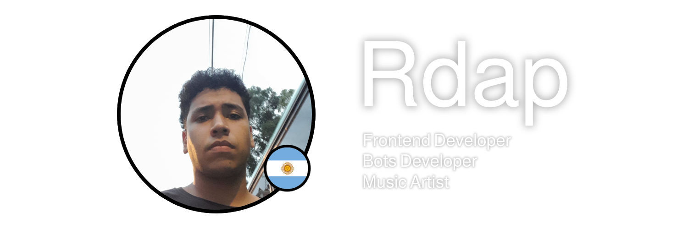

<!-- Banner -->
<!--  -->

<!-- Start -->
<h1 align="center">Hey, I'm Rdap 🦇</h1>

A web developer and a music producer. Born in 2004 and based (for now) in Medellin, Colombia.

"Rdap" is an acronym that basically stands for some letters of my name and it's pronounced "R-dap". 😄

 
 
<h1 align="center">Skills</h1>

    

 
 
<h1 align="center">Expert In</h1>

    

 
 

    <small align="center">&copy; 2025 Rdap</small>

<!--  -->
